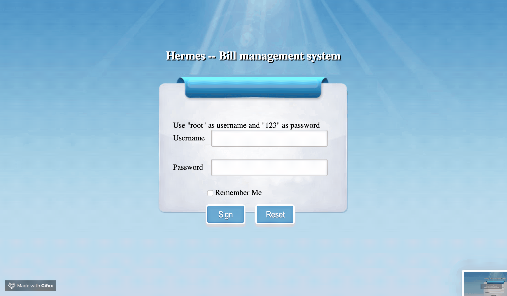
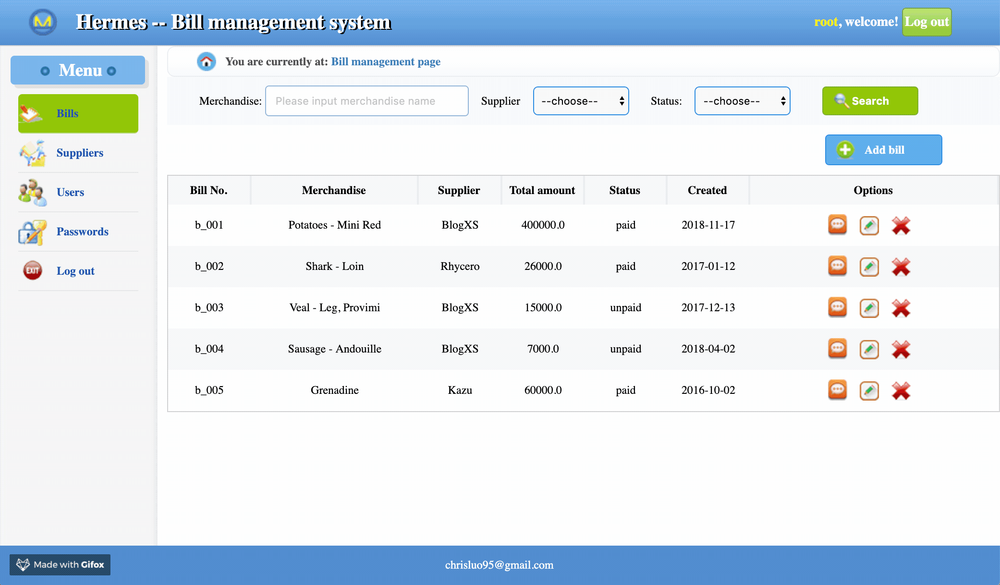
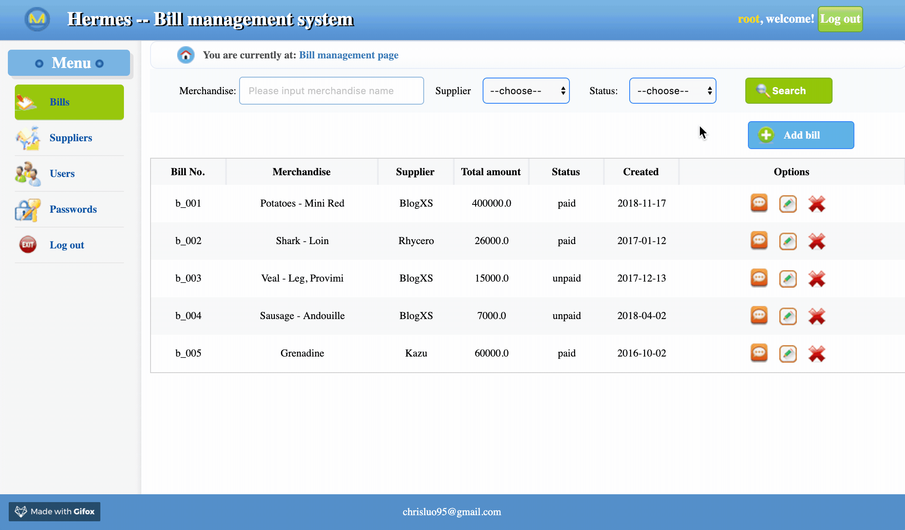
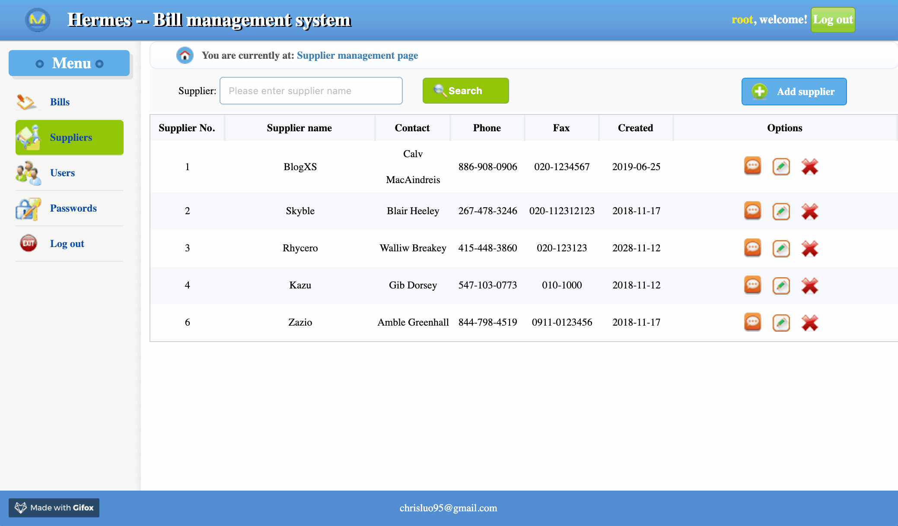

# Hermes -- Bill management system

- The website application provides search and CRUD functionalities for business users to store and manage their bills. 
- Designed the site using Spring framework and MVC architecture; integrated Redis cache and Druid monitor.
  

## Login

  

## Search for bills

  

## Add a bill

  

## Delete a bill

